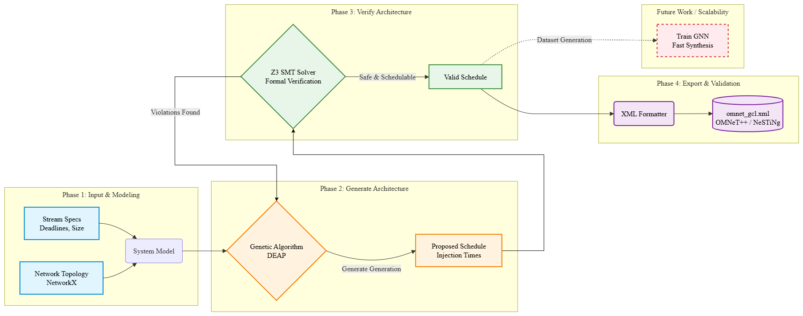

# AI-Driven Gate Scheduling for TSN: A Generate-and-Verify Approach

## Project Overview
This project automates the creation and verification of Gate Control Lists (GCL) for Time-Sensitive Networking (TSN), specifically based on the **IEEE 802.1Qbv (Time-Aware Shaper)** standard. 

Calculating collision-free schedules across multi-hop network topologies is a highly complex problem. To solve this, the project uses a **Generate-and-Verify** architecture: it uses a Genetic Algorithm (AI) to generate an optimized schedule across network links, and a Z3 Solver (Formal Verification) to mathematically prove the schedule is safe, before finally exporting it for network simulators.

## Architecture
The system is built in four main phases:

1. **Network Modeling (Topology & Routing):** 
   Uses `NetworkX` to define End Systems (ES), Switches (SW), and directed links with propagation delays. Data streams are defined with specific multi-hop routing paths, durations, and strict end-to-end deadlines.
   
2. **Generate Phase (Genetic Algorithm):**
   Uses **DEAP** to explore scheduling possibilities (injection times at the source). The fitness function calculates store-and-forward delays and penalizes missed deadlines or overlaps on shared physical links.
   
3. **Verify Phase (Formal Verification):**
   Passes the generated source injection times to the **Z3 Theorem Prover**. Z3 checks the schedule against strict mathematical constraints across the entire route (e.g., $t_{arrival} + duration \le deadline$ and $End_1 \le Start_2 \lor End_2 \le Start_1$ on shared links). 
   
4. **Export Phase (OMNeT++ / NeSTiNg):**
   Once verified, the link-specific schedules are automatically parsed and exported into a standard XML format compatible with OMNeT++ (NeSTiNg) for network simulation.

### Architecture Diagram


## Technologies Used
* **python:3.10-slim**: Core programming language.
* **NetworkX**: Used for modeling the multi-hop network graph and tracking routing paths.
* **DEAP**: Evolutionary computation framework used for the Genetic Algorithm.
* **Z3-Solver**: Theorem prover from Microsoft Research used for formal verification.
* **XML Processing**: Standard libraries used to generate OMNeT++ compatible configuration files.
* **Docker**: Used to containerize the application for easy and consistent execution.

## How to Run
This project is fully containerized. Make sure you have [Docker](https://www.docker.com/) installed.

1. **Clone the repository:**
   ```bash
   git clone https://github.com/barzansaeedpour/AI-Driven-Gate-Scheduling-for-TSN-A-Generate-and-Verify-Approach.git
   cd AI-Driven-Gate-Scheduling-for-TSN-A-Generate-and-Verify-Approach
   ```

2. **Build the Docker image:**
   ```bash
   docker build -t tsn-scheduler .
   ```

3. **Run the container:**
   ```bash
   docker-compose up
   ```

## Expected Output
Upon execution, the GA explores generations to find a collision-free schedule, which Z3 mathematically proves. Finally, an XML file is generated. 

**Terminal Output:**
```text
========== GA-VERIFY LOOP 1 ==========
--- Phase 2: Generating Schedule (GA) ---
GA Injection -> Stream_A: Source Start at 5
GA Injection -> Stream_B: Source Start at 0
GA Injection -> Stream_C: Source Start at 1

--- Phase 3: Formal Verification with Z3 ---
✅ VERIFIED: The GA schedule is mathematically VALID across the network.

--- Phase 4: Exporting GCL to OMNeT++ XML ---
✅ Exported schedule to 'omnet_gcl.xml'
```
**Generated `omnet_gcl.xml` Snippet:**

```xml
<?xml version="1.0" ?>
<schedule>
    <port name="ES1_to_SW1">
        <entry stream="Stream_C" start_time="1" duration="1"/>
        <entry stream="Stream_A" start_time="5" duration="2"/>
    </port>
    <port name="SW1_to_ES3">
        <entry stream="Stream_B" start_time="4" duration="3"/>
        <entry stream="Stream_A" start_time="8" duration="2"/>
    </port>
    <port name="ES2_to_SW1">
        <entry stream="Stream_B" start_time="0" duration="3"/>
    </port>
    <port name="SW1_to_ES4">
        <entry stream="Stream_C" start_time="3" duration="1"/>
    </port>
</schedule>
```

## Future Work
* **Reinforcement Learning (RL):** Replace the Genetic Algorithm with an RL agent (like PPO or DQN) to learn optimal scheduling policies dynamically.
* **Hardware Implementation:** Deploy the generated configurations onto actual TSN-capable edge hardware (e.g., Linux Qdisc/Taprio or Jetson platforms).

