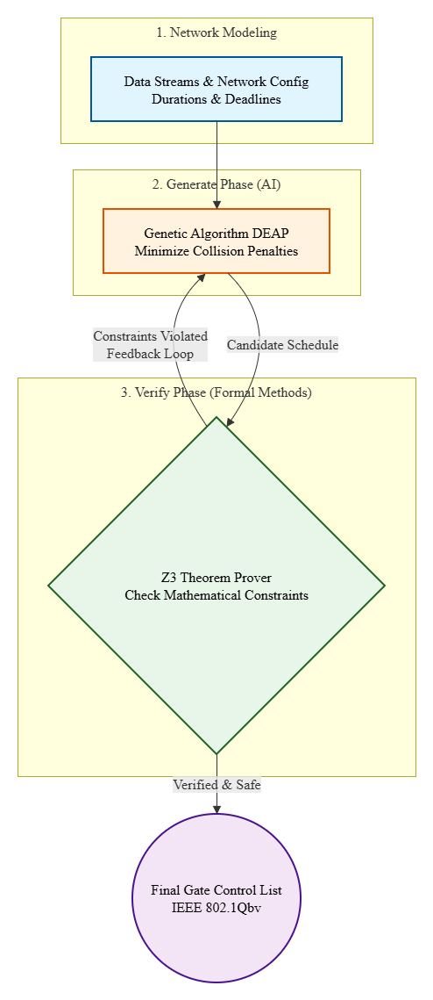

# AI-Driven Gate Scheduling for TSN: A Generate-and-Verify Approach

## Project Overview
This project automates the creation and verification of Gate Control Lists (GCL) for Time-Sensitive Networking (TSN), specifically based on the **IEEE 802.1Qbv (Time-Aware Shaper)** standard. 

Calculating the perfect schedule for network gates to avoid collisions and meet strict deadlines is a complex problem. To solve this, the project uses a **Generate-and-Verify** architecture: it uses Artificial Intelligence (Genetic Algorithms) to generate a smart schedule, and then uses Formal Verification (Z3 Solver) to mathematically prove that the schedule is valid and safe.

## Architecture
The system is built in three main phases:

1. **Network Modeling:** 
   Defines the network environment and data streams. Each stream is categorized as time-sensitive (critical) with a specific duration and a strict deadline.
   
2. **Generate Phase (AI/Heuristic):**
   Uses a **Genetic Algorithm (GA)** to explore different scheduling possibilities. The fitness function is designed to minimize penalties like missed deadlines or packet collisions. It quickly finds a highly optimized schedule.
   
3. **Verify Phase (Formal Verification):**
   Passes the generated schedule to the **Z3 Theorem Prover**. Z3 checks the schedule against strict mathematical constraints (e.g., $start\_time + duration \le deadline$ and no overlapping streams). This ensures 100% deterministic safety.

### Architecture Diagram


## Technologies Used
* **Python 3.9+**: Core programming language.
* **DEAP**: Evolutionary computation framework used for the Genetic Algorithm.
* **Z3-Solver**: Theorem prover from Microsoft Research used for formal verification.
* **Docker**: Used to containerize the application for easy and consistent execution.

## How to Run
This project is fully containerized. You do not need to install the Python libraries manually on your machine. Just make sure you have [Docker](https://www.docker.com/) installed.

1. **Clone the repository:**
   ```bash
   git clone https://github.com/barzansaeedpour/AI-Driven-Gate-Scheduling-for-TSN-A-Generate-and-Verify-Approach.git
   cd AI-Driven-Gate-Scheduling-for-TSN-A-Generate-and-Verify-Approach
   ```

2. **Build the Docker image:**
   ```bash
   docker build -t tsn-scheduler .
   ```

3. **Run the container:**
   ```bash
   docker run --rm tsn-scheduler
   ```


## Expected Output
Upon executing the container, the Genetic Algorithm explores multiple generations to find an optimal, collision-free schedule. This candidate is then passed directly to the Z3 Solver for mathematical proof. You will see terminal output similar to this:

```text
========== GA-VERIFY LOOP 1 ==========
--- Phase 2: Generating Schedule (Genetic Algorithm) ---
GA Proposed -> Stream_A: Start at 0, Duration: 2, Deadline: 5
GA Proposed -> Stream_B: Start at 3, Duration: 3, Deadline: 10
GA Proposed -> Stream_C: Start at 7, Duration: 4, Deadline: 15

--- Phase 3: Formal Verification with Z3 ---
✅ VERIFIED: The GA schedule is mathematically VALID.
```

## Future Work
* **Scale up the network:** Add multiple switches and more complex routing topologies using `NetworkX`.
* **Reinforcement Learning (RL):** Replace the Genetic Algorithm with an RL agent (like PPO or DQN) to learn optimal scheduling policies over time.
* **Hardware Co-simulation:** Connect the generated Gate Control Lists (GCL) to a realistic network simulator like OMNeT++.

## Contact
**Barzan Saeedpour**
* **Role:** Lead ML Engineer | Hardware-Software Co-optimization Enthusiast
* **Email:** barzansaeedpour@gmail.com
