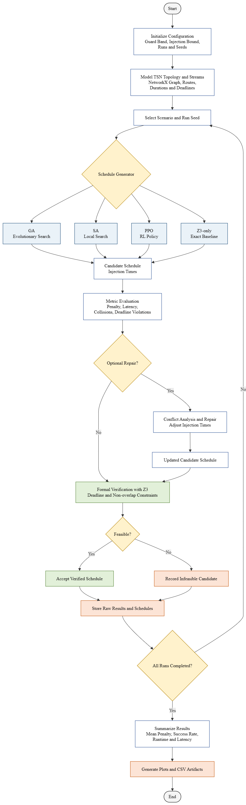

# AI-Driven Gate Scheduling for TSN: A Generate-and-Verify Research Prototype

## Paper
This repository is accompanied by a conference-style paper describing the motivation, problem formulation, generate-and-verify framework, and experimental results.

**Title:** *AI-Driven Gate Scheduling for Time-Sensitive Networking: A Generate-and-Verify Approach*

You can find the paper here:

- [PDF](./paper/AI-Driven_Gate_Scheduling_for_TSN_A_Generate_and_Verify_Approach.pdf)

The paper presents the scheduling model, the GA / SA / PPO / Z3-based comparison, the conflict-guided repair mechanism, and the benchmark results discussed in this repository.


## Overview
This repository presents a research-oriented prototype for **AI-driven scheduling and formal verification in Time-Sensitive Networking (TSN)**. The project focuses on **source injection-time scheduling** for deterministic traffic over multi-hop TSN topologies under **IEEE 802.1Qbv-inspired** timing and non-overlap constraints.

The main goal is to study how **learning-based and search-based AI methods** can be combined with **deterministic verification** to address hard scheduling problems in **distributed cyber-physical real-time systems**.

Instead of relying on a single optimization strategy, the framework implements and compares several schedule-generation approaches:

- **Genetic Algorithm (GA)**
- **Reinforcement Learning with PPO**
- **Simulated Annealing (SA)**
- **Z3-only symbolic scheduling baseline**
- **Repair-enhanced variants** of heuristic and learning-based methods

All generated schedules are evaluated through a **Generate-and-Verify pipeline**, where candidate schedules are produced by AI/search methods and then checked against formal timing and collision constraints.

This project is especially relevant to research directions at the intersection of:

- **AI-assisted combinatorial optimization**
- **Formal analysis and verification**
- **TSN scheduling and configuration**
- **Distributed real-time and embedded systems**
- **Cyber-physical system engineering**

---

## Motivation
Scheduling deterministic traffic in TSN networks is a combinatorial problem with strict correctness requirements. Even when a candidate schedule appears promising, it may still violate:

- end-to-end deadlines,
- shared-link non-overlap constraints,
- guard-band separation requirements,
- or overall feasibility conditions.

This motivates a **Generate-and-Verify architecture**:

1. **Generate** candidate schedules quickly using AI or search.
2. **Analyze and optionally repair** invalid schedules.
3. **Verify** final candidates using symbolic constraints.

This design reflects a broader research direction in real-time systems:

> Use AI or metaheuristics for efficient schedule generation, while retaining formal verification as the correctness layer.

---

## Main Contributions
This prototype demonstrates the following:

- A **multi-algorithm scheduling framework** for TSN source injection-time scheduling
- A **Generate-and-Verify workflow** combining AI/search with formal checking
- A lightweight **conflict-guided repair stage** for invalid schedules
- A **reproducible experimental pipeline** with:
  - multiple benchmark scenarios,
  - repeated runs over fixed random seeds,
  - CSV logging,
  - summary statistics,
  - publication-style plots
- A compact foundation for future work on:
  - **constraint-guided learning**
  - **GNN-based schedule generation**
  - **predict-then-check methods**
  - **heterogeneous TSN scheduling**
  - **verifier-guided repair**

---

## System Architecture
The framework is organized into the following phases:

### 1. Network Modeling
Using **NetworkX**, the repository models a directed TSN topology composed of:

- **End Systems (ES)**
- **Switches (SW)**
- **Directed links with propagation delay**

Each traffic stream is defined by:

- an identifier,
- transmission duration,
- end-to-end deadline,
- and a fixed multi-hop route.

This provides a compact abstraction of deterministic scheduling problems in distributed real-time communication systems.

---

### 2. Generate Phase
Candidate schedules are generated as **source injection times** for each stream. The following methods are implemented:

#### Genetic Algorithm (GA)
Using **DEAP**, the GA explores discrete injection-time assignments and minimizes a penalty function encoding deadline violations and shared-link collisions.

#### Reinforcement Learning (PPO)
Using **Stable-Baselines3**, a PPO agent sequentially assigns injection times stream by stream. Reward shaping is based on partial and final penalty reduction.

#### Simulated Annealing (SA)
A stochastic local-search baseline that perturbs candidate schedules and probabilistically accepts worse moves early on to escape local minima.

#### Z3-Only Scheduling
A **bounded symbolic scheduling baseline** that searches directly for feasible schedules within the modeled injection-time horizon using hard constraints and an optimization objective.

---

### 3. Analyze-and-Repair Phase
For heuristic and learning-based methods, the framework includes a lightweight **repair stage** that:

- detects deadline violations,
- detects collisions on shared links,
- shifts conflicting streams,
- and keeps modifications only when the total penalty decreases.

This stage is intended to improve invalid schedules before final verification. However, it is **not guaranteed to improve every generator**. In the current experiments, repair substantially helps PPO in the contention-heavy scenario, while it can degrade GA in some cases. This makes repair an important but still evolving component of the framework.

---

### 4. Verify Phase
The final schedule is checked using the **Z3 solver**.

Verification focuses on:

- end-to-end deadline satisfaction,
- collision freedom on shared links,
- and guard-band-aware non-overlap constraints.

Formally, for two transmissions sharing a link, the verifier enforces disjunctive separation of the form:

$$
t_1 + d_1 + g \le t_2 \;\;\lor\;\; t_2 + d_2 + g \le t_1
$$

where:

- $t_1, t_2$ are link-local transmission start times,
- $d_1, d_2$ are transmission durations,
- $g$ is the guard band.

This creates a clear separation between:

- **fast schedule generation**, and
- **sound schedule validation**.

---

### 5. Experimental Evaluation
The project supports repeated experiments across scenarios and seeds, and reports:

- penalty
- feasibility
- Z3 verification success
- collision count
- deadline violations
- total lateness
- total latency
- maximum latency
- training time (for RL)
- search/inference runtime

It also exports:

- raw per-run CSV results,
- summary statistics,
- generated schedules,
- and comparison plots for reporting and analysis.

---

## Architecture Diagram


Higher-quality version: [PDF](./files/f.pdf)

---

## Implemented Scheduling Algorithms

| Algorithm | Role | Type |
|---|---|---|
| `GA` | Baseline schedule generator | Evolutionary optimization |
| `GA_Repair` | GA + conflict-guided repair | Hybrid heuristic |
| `RL_PPO` | Learned schedule generator | Reinforcement learning |
| `RL_PPO_Repair` | PPO + repair | Hybrid learning-based |
| `SA` | Metaheuristic baseline | Simulated annealing |
| `SA_Repair` | SA + repair | Hybrid metaheuristic |
| `Z3_Only` | Symbolic baseline within the bounded model | Formal / constraint-based |

---

## Core Evaluation Logic
The objective function captures the essential scheduling quality criteria.

### Deadline Satisfaction
For each stream, the final finish time across its route is compared against its end-to-end deadline.

### Collision Avoidance
Streams sharing a physical link must not overlap, including a configurable **guard band**.

### Latency Tracking
The framework reports:

- total latency across all streams,
- maximum individual latency.

### Feasibility
A schedule is considered successful only when it is **formally verified as feasible**. In practice, zero penalty and successful Z3 verification are used together as the final correctness criterion.

This makes the framework suitable not only for optimization but also for **multi-metric comparison of scheduling strategies**.

---

## Technology Stack
- **Python 3.10**
- **NetworkX** — topology and path modeling
- **NumPy** — numerical support
- **DEAP** — genetic algorithm implementation
- **Stable-Baselines3** — PPO reinforcement learning
- **Gymnasium** — RL environment design
- **Z3-Solver** — symbolic optimization and verification
- **Matplotlib** — academic plotting
- **CSV / standard Python tooling** — result logging and reproducibility
- **Docker** — containerized execution

---

## Repository Purpose
This repository should be viewed as a **research prototype**, not only as a software artifact.

It is designed to explore questions such as:

- Can AI methods generate TSN schedules fast enough to be useful in engineering workflows?
- How much can repair and verification improve unreliable generated candidates?
- What trade-offs emerge between learning-based, metaheuristic, and solver-based methods?
- When does repair help, and when can it interfere with already near-feasible schedules?
- How can a Generate-and-Verify workflow support future tooling for distributed real-time systems?

These questions are directly relevant to current research in:

- **AI-assisted engineering automation**
- **real-time systems tooling**
- **hybrid ML + formal methods**
- **cyber-physical system design**

---

## How to Run

### 1. Clone the repository
```bash
git clone https://github.com/barzansaeedpour/AI-Driven-Gate-Scheduling-for-TSN-A-Generate-and-Verify-Approach.git
cd AI-Driven-Gate-Scheduling-for-TSN-A-Generate-and-Verify-Approach
```

### 2. Install dependencies
If you are running locally:

```bash
pip install -r requirements.txt
```
If the project is containerized:

```bash
docker-compose up --build
```
---

## Expected Outputs
Running the experimental pipeline produces artifacts such as:

- `raw_comparison_results.csv`
- `summary_results.csv`
- `schedule_details.csv`
- `mean_penalty_comparison.pdf` / `.png`
- `success_rate_comparison.pdf` / `.png`
- `runtime_comparison.pdf` / `.png`

The script also reports summary statistics including:

- mean penalty,
- penalty standard deviation,
- success / verification rate,
- mean latency,
- runtime statistics.

This makes the repository suitable for **algorithmic comparison and research reporting**.

---

## Current Scenario Model
The current implementation includes compact **Small** and **Medium** scenarios over a directed topology. These are intentionally lightweight to allow:

- fast algorithm iteration,
- reproducible comparison across methods,
- and easy extension to larger benchmark instances.

The code structure is ready to be extended toward:

- larger TSN topologies,
- more streams,
- richer traffic models,
- queue-aware scheduling,
- and more expressive TSN configuration workflows.

---

## Experimental Findings
The current benchmark results support the following high-level observations:

- In the **small scenario**, most methods achieve high or perfect feasibility.
- In the **medium scenario**, the methods separate more clearly in robustness.
- **SA** and **Z3-only** are the most consistent methods in the evaluated cases.
- **GA** remains competitive but occasionally fails.
- **PPO alone** struggles in the contention-heavy scenario.
- **Repair significantly improves PPO**, but **does not universally help all generators**.

These findings reinforce the value of combining fast candidate generation with formal verification rather than relying on heuristic quality alone.

---

## Research Relevance
This repository aligns strongly with current research themes in distributed real-time systems, including:

- **Generate-and-Verify scheduling architectures**
- **AI-assisted scheduling for TSN**
- **metaheuristics for real-time communication**
- **deterministic validation of AI-generated artifacts**
- **tool support for cyber-physical system engineering**

It is particularly relevant as an initial prototype for future work on:

- **constraint-guided RL**
- **predict-then-check scheduling**
- **GNN-based schedule synthesis**
- **mixed-criticality traffic scheduling**
- **heterogeneous TSN environments**
- **verifier-guided or UNSAT-core-aware repair**

---

## Limitations
This is a compact research prototype and currently makes several simplifying assumptions:

- fixed stream routes,
- **source injection-time optimization only**,
- simplified collision and delay model,
- no full IEEE 802.1Qbv gate-cycle or Gate Control List synthesis,
- no direct modeling of ATS / CBS / CQF combinations,
- no dynamic rescheduling,
- no full OMNeT++ / NeSTiNg integration in the current experiment script.

---

## Future Work
Natural extensions include:

- **Graph Neural Networks (GNNs)** for schedule or priority synthesis
- **constraint-guided RL** for safer schedule generation
- **verifier-guided repair**
- **UNSAT-core-based conflict extraction**
- **multi-objective optimization** over latency, jitter, utilization, and robustness
- **heterogeneous TSN scheduling**
- **larger-scale benchmarks** and industrial-style topologies
- **dynamic rescheduling**
- **OMNeT++ / NeSTiNg export integration**
- richer TSN scheduling models beyond source injection-time optimization

---

## Citation / Contact
If you are interested in this repository for research collaboration, benchmarking, or extension toward real-time distributed system tooling, feel free to contact the author.

**Author:** Barzan Saeedpour  
**Email:** barzansaeedpour@gmail.com

